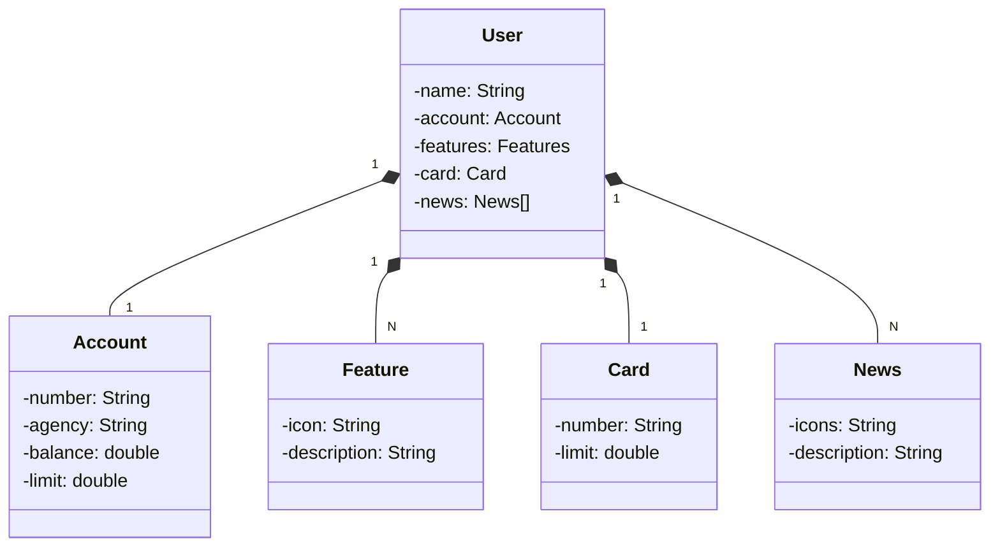

### Projeto ###
Java RESTful API criada para a Santander Dev Week.

### Diagrama de Classe ###

```mermaid
classDiagram
    class User {
        -name: String
        -account: Account
        -features: Features
        -card: Card
        -news: News[]
    }

    class Account {
        -number: String
        -agency: String
        -balance: double
        -limit: double
    }

    class Feature {
        -icon: String
        -description: String
    }

    class Card {
        -number: String
        -limit: double
    }

    class News {
        -icons: String
        -description: String
    }

    User "1" *-- "1" Account
    User "1" *-- "N" Feature
    User "1" *-- "1" Card
    User "1" *-- "N" News
```
